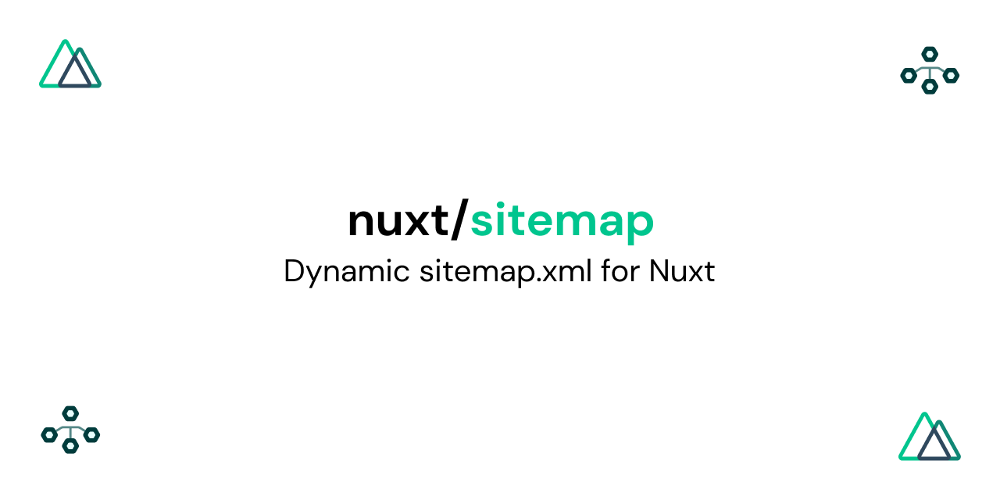

# Sitemap Module

> Automatically generate or serve dynamic [sitemap.xml](https://www.sitemaps.org/protocol.html) for Nuxt projects!

  <a href="https://sitemap.nuxtjs.org">Read Documentation</a>

[📖 **Release Notes**](./CHANGELOG.md)

## License

[MIT License](./LICENSE)

## Contributors

- [Nicolas Pennec](https://github.com/NicoPennec)
- [Pooya Parsa](https://github.com/pi0)
